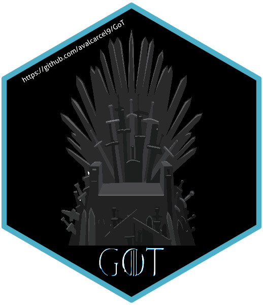

[](https://travis-ci.org/avalcarcel9/GoT)

[](https://ci.appveyor.com/project/avalcarcel9/GoT)

[](https://cran.r-project.org/package=GoT)

<!-- README.md is generated from README.Rmd. Please edit that file -->

# GoT 

The goal of GoT is to help scraping some Game of Thrones data from the
internet.

## Installation

You can install the development version from
[GitHub](https://github.com/avalcarcel9/GoT) with:

``` r
# install.packages("devtools")
devtools::install_github("avalcarcel9/GoT")
```

**Warning: This package scrapes data from the internet. Please be
mindful of pinging servers too frequently and of the user agreements for
sharing data.**

## Setup

This package is dependent on the `geniusr` package and you must have an
API token. Go [here](https://genius.com/) to create an account or login
and obtain an API token. For more information on the API creation you
can look at the genius documentation
[here](https://docs.genius.com/#!#%2Fgetting-started-h1).

Once you’ve created an account and obtained an API they’ll assign you a
token. Be sure to copy the token. With the token copied you can add it
to the R environment with some code.

Running the following code will open your .Renviron

``` r
user_renviron = path.expand(file.path("~", ".Renviron"))
if(!file.exists(user_renviron)) # check to see if the file already exists
  file.create(user_renviron)
file.edit(user_renviron) # open with another text editor if this fails
```

Once this file is open paste the following into the script:

``` r
GENIUS_API_TOKEN="your-token-goes-here"
```

If done properly then this code will return your API token.

``` r
Sys.getenv("GENIUS_API_TOKEN")
```

## Use

For a more thorough walkthrough please see my [blog
post](http://www.alessandravalcarcel.com/blog/2018-04-1-r-rmarkdown-got-scrape/).

``` r
library(GoT)
```

This package helps you scrape a the Game of Thrones scripts from
[www.genius.com](www.genius.com) and some character lists online.

To scrape the scripts from genius you can use `GoT::scrape_GoT()`.

``` r
base_url = "https://genius.com/albums/Game-of-thrones"
info = GoT::scrape_GoT(base_url = base_url, season = 7)
#> Warning in stri_match_all_regex(string, pattern, omit_no_match = TRUE,
#> opts_regex = opts(pattern)): argument is not an atomic vector; coercing

#> Warning in stri_match_all_regex(string, pattern, omit_no_match = TRUE,
#> opts_regex = opts(pattern)): argument is not an atomic vector; coercing

#> Warning in stri_match_all_regex(string, pattern, omit_no_match = TRUE,
#> opts_regex = opts(pattern)): argument is not an atomic vector; coercing

#> Warning in stri_match_all_regex(string, pattern, omit_no_match = TRUE,
#> opts_regex = opts(pattern)): argument is not an atomic vector; coercing

#> Warning in stri_match_all_regex(string, pattern, omit_no_match = TRUE,
#> opts_regex = opts(pattern)): argument is not an atomic vector; coercing

#> Warning in stri_match_all_regex(string, pattern, omit_no_match = TRUE,
#> opts_regex = opts(pattern)): argument is not an atomic vector; coercing

#> Warning in stri_match_all_regex(string, pattern, omit_no_match = TRUE,
#> opts_regex = opts(pattern)): argument is not an atomic vector; coercing
#> Warning: Grouping rowwise data frame strips rowwise nature
head(info)
#> # A tibble: 6 x 6
#>   song_number album_name      
#>         <dbl> <chr>           
#> 1           1 Season 1 Scripts
#> 2           1 Season 1 Scripts
#> 3           1 Season 1 Scripts
#> 4           1 Season 1 Scripts
#> 5           1 Season 1 Scripts
#> 6           1 Season 1 Scripts
#>   line                                                                     
#>   <chr>                                                                    
#> 1 WAYMAR ROYCE: What d’you expect? They’re savages. One lot steals a goat …
#> 2 WILL: I’ve never seen wildlings do a thing like this. I’ve never seen a …
#> 3 WAYMAR ROYCE: How close did you get?                                     
#> 4 WILL: Close as any man would.                                            
#> 5 GARED: We should head back to the wall.                                  
#> 6 ROYCE: Do the dead frighten you?                                         
#>   song_lyrics_url                                              
#>   <chr>                                                        
#> 1 https://genius.com/Game-of-thrones-winter-is-coming-annotated
#> 2 https://genius.com/Game-of-thrones-winter-is-coming-annotated
#> 3 https://genius.com/Game-of-thrones-winter-is-coming-annotated
#> 4 https://genius.com/Game-of-thrones-winter-is-coming-annotated
#> 5 https://genius.com/Game-of-thrones-winter-is-coming-annotated
#> 6 https://genius.com/Game-of-thrones-winter-is-coming-annotated
#>   song_name        artist_name    
#>   <chr>            <chr>          
#> 1 Winter is Coming Game of Thrones
#> 2 Winter is Coming Game of Thrones
#> 3 Winter is Coming Game of Thrones
#> 4 Winter is Coming Game of Thrones
#> 5 Winter is Coming Game of Thrones
#> 6 Winter is Coming Game of Thrones
tail(info)
#> # A tibble: 6 x 6
#>   song_number album_name      
#>         <dbl> <chr>           
#> 1          10 Season 6 Scripts
#> 2          10 Season 6 Scripts
#> 3          10 Season 6 Scripts
#> 4          10 Season 6 Scripts
#> 5          10 Season 6 Scripts
#> 6          10 Season 6 Scripts
#>   line                                                                     
#>   <chr>                                                                    
#> 1 CERSEI enters, escorted by GREGOR and the Kingsguard. The room is full o…
#> 2 QYBURN: I now proclaim Cersei of the House Lannister First of Her Name, …
#> 3 QYBURN places the crown on CERSEI’s head. CERSEI sits in the Iron Throne…
#> 4 QYBURN: Long may she reign.                                              
#> 5 ALL: Long may she reign.                                                 
#> 6 THEON and YARA are standing on their ship. They look out at the sea. A v…
#>   song_lyrics_url                                                        
#>   <chr>                                                                  
#> 1 https://genius.com/Game-of-thrones-the-winds-of-winter-script-annotated
#> 2 https://genius.com/Game-of-thrones-the-winds-of-winter-script-annotated
#> 3 https://genius.com/Game-of-thrones-the-winds-of-winter-script-annotated
#> 4 https://genius.com/Game-of-thrones-the-winds-of-winter-script-annotated
#> 5 https://genius.com/Game-of-thrones-the-winds-of-winter-script-annotated
#> 6 https://genius.com/Game-of-thrones-the-winds-of-winter-script-annotated
#>   song_name                    artist_name    
#>   <chr>                        <chr>          
#> 1 The Winds of Winter (Script) Game of Thrones
#> 2 The Winds of Winter (Script) Game of Thrones
#> 3 The Winds of Winter (Script) Game of Thrones
#> 4 The Winds of Winter (Script) Game of Thrones
#> 5 The Winds of Winter (Script) Game of Thrones
#> 6 The Winds of Winter (Script) Game of Thrones
```

This function will scrape all the seasons up to the season indicated as
the function input.

To clean this data somewhat, we can utilize `GoT::cleanGoT()`. This
function generally tries to identify the speaking character and removes
some of the stage direction or narration.

``` r
cleaned_data = GoT::cleanGoT(info)
head(cleaned_data)
#> # A tibble: 6 x 6
#>   episode season
#>     <dbl>  <dbl>
#> 1       1      1
#> 2       1      1
#> 3       1      1
#> 4       1      1
#> 5       1      1
#> 6       1      1
#>   line                                                                     
#>   <chr>                                                                    
#> 1 What d’you expect? They’re savages. One lot steals a goat from another l…
#> 2 I’ve never seen wildlings do a thing like this. I’ve never seen a thing …
#> 3 How close did you get?                                                   
#> 4 Close as any man would.                                                  
#> 5 We should head back to the wall.                                         
#> 6 Do the dead frighten you?                                                
#>   speaker      action
#>   <chr>        <chr> 
#> 1 Waymar Royce ""    
#> 2 Will         ""    
#> 3 Waymar Royce ""    
#> 4 Will         ""    
#> 5 Gared        ""    
#> 6 Royce        ""    
#>   orig_line                                                                
#>   <chr>                                                                    
#> 1 WAYMAR ROYCE: What d’you expect? They’re savages. One lot steals a goat …
#> 2 WILL: I’ve never seen wildlings do a thing like this. I’ve never seen a …
#> 3 WAYMAR ROYCE: How close did you get?                                     
#> 4 WILL: Close as any man would.                                            
#> 5 GARED: We should head back to the wall.                                  
#> 6 ROYCE: Do the dead frighten you?
```

We can also scrape character lists from two websites:

1.  <http://awoiaf.westeros.org/index.php/List_of_characters>
2.  <https://www.hbo.com/game-of-thrones/cast-and-crew>

<!-- end list -->

``` r
# Scrape wiki characters and save
url = "http://awoiaf.westeros.org/index.php/List_of_characters"
wiki_characters = GoT::scrape_characters(url)

head(wiki_characters)
#>                                                                                                                 raw
#> 1                                                      Our Sites WesterosForum of Ice and FireBlood of Dragons MUSH
#> 2                                                                                                          Westeros
#> 3                                                                                             Forum of Ice and Fire
#> 4                                                                                             Blood of Dragons MUSH
#> 5 Community portal BooksChapter SummariesCharactersHouses of WesterosTimeline of major eventsGeograpyCultureTV Show
#> 6                                                                                                             Books
#>                                                                                                               names
#> 1                                                      Our Sites WesterosForum of Ice and FireBlood of Dragons MUSH
#> 2                                                                                                          Westeros
#> 3                                                                                             Forum of Ice and Fire
#> 4                                                                                             Blood of Dragons MUSH
#> 5 Community portal BooksChapter SummariesCharactersHouses of WesterosTimeline of major eventsGeograpyCultureTV Show
#> 6                                                                                                             Books
#>   description
#> 1            
#> 2            
#> 3            
#> 4            
#> 5            
#> 6

# Scrape HBO characters and save
url = 'https://www.hbo.com/game-of-thrones/cast-and-crew'
hbo_characters = GoT::scrape_HBO_characters(url)

head(hbo_characters)
#>         scraped_name first_name last_name nickname             joined_name
#> 1 Eddard "Ned" Stark     Eddard     Stark      Ned Eddard Stark|Ned|Eddard
#> 2   Robert Baratheon     Robert Baratheon          Robert Baratheon|Robert
#> 3   Tyrion Lannister     Tyrion Lannister          Tyrion Lannister|Tyrion
#> 4   Cersei Lannister     Cersei Lannister          Cersei Lannister|Cersei
#> 5      Catelyn Stark    Catelyn     Stark            Catelyn Stark|Catelyn
#> 6    Jaime Lannister      Jaime Lannister            Jaime Lannister|Jaime
#>          full_name
#> 1     Eddard Stark
#> 2 Robert Baratheon
#> 3 Tyrion Lannister
#> 4 Cersei Lannister
#> 5    Catelyn Stark
#> 6  Jaime Lannister
```

## Death Timeline

We can also obtain death timeline data from
<https://deathtimeline.com/>.

``` r
death_times = GoT::get_death_times()
head(death_times)
#> # A tibble: 6 x 6
#>   who          how                    times    season episode specific_how
#>   <chr>        <chr>                  <chr>     <dbl>   <dbl> <chr>       
#> 1 Waymar Royce killed by white walker 00:05:52      1       1 White Walker
#> 2 Gared        killed by white walker 00:06:58      1       1 White Walker
#> 3 Will         executed by ned stark  00:13:44      1       1 Ned Stark   
#> 4 Jon Arryn    poisoned by lysa       00:18:34      1       1 Lysa        
#> 5 Assassin     killed by bran's wolf  00:31:27      1       2 Bran's Wolf 
#> 6 Mycah        killed by the hound    00:04:37      1       2 The Hound
```

Unfortunately, this timeline only goes up to season 6 so I’ll use a this
article <http://time.com/3924852/every-game-of-thrones-death/> as a
supplement.

``` r
url = 'http://time.com/3924852/every-game-of-thrones-death/'
time.com_deaths = GoT::get_time.com_deaths(url = url)
head(time.com_deaths)
#> # A tibble: 6 x 6
#>   who               season episode times
#>   <chr>              <dbl>   <dbl> <lgl>
#> 1 Will                   1       1 NA   
#> 2 Jon Arryn              1       1 NA   
#> 3 Jory Cassel            1       5 NA   
#> 4 Viserys Targaryen      1       6 NA   
#> 5 Benjen Stark           1       7 NA   
#> 6 Robert Baratheon       1       7 NA   
#>   how                                                                      
#>   <chr>                                                                    
#> 1 Beheaded for desertion by Ned Stark                                      
#> 2 Poisoned by Lysa Arryn and Littlefinger                                  
#> 3 Stabbed by Jaime Lannister through the eye                               
#> 4 Khal Drogo pours molten gold on his head at Daenerys’ command            
#> 5 Killed by White Walkers                                                  
#> 6 Mortally wounded by a wild boar after drinking wine given to him by Lanc…
#>   specific_how                                                             
#>   <chr>                                                                    
#> 1 Beheaded for desertion by Ned Stark                                      
#> 2 Poisoned by Lysa Arryn and Littlefinger                                  
#> 3 Stabbed by Jaime Lannister through the eye                               
#> 4 Khal Drogo pours molten gold on his head at Daenerys’ command            
#> 5 Killed by White Walkers                                                  
#> 6 Mortally wounded by a wild boar after drinking wine given to him by Lanc…
```
